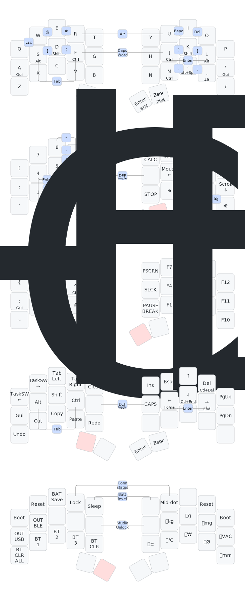
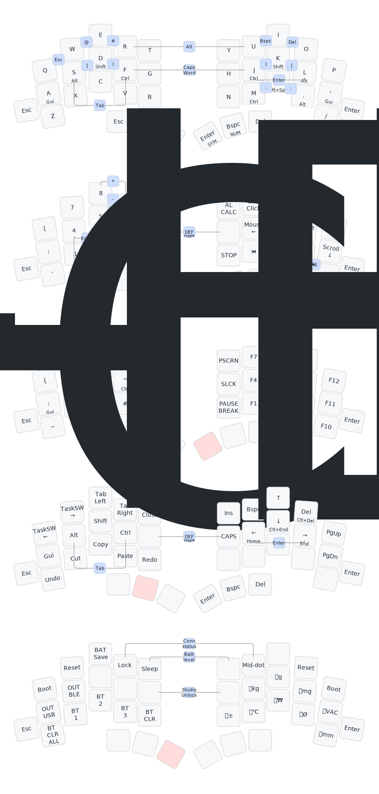

# zmk-config

This is my personal [zmk-config](https://zmk.dev/) for my Split keyboards.  
Sweep Bluethooth(Nice!Nano) or Display Dongle(Nice!Naon or Xiao_ble), Studio available.  
Totem Bluethooth(Xiao_ble) or Dongle(Xiao_ble), Studio available.  

Uses Urob's Timeless-Home-row-mods. 
Provides RCTRL, RShift, RALT on the Default layer R4 row. 

The thumb, number, symbol, and function layers follow the Miryoku layout almost exactly. 

The number layer provides the four basic arithmetic operations as combo keys, just like a full-size keyboard. 

There are symbol layers, but frequently used symbols are provided as combos. Function keys are provided on the opposite side of the symbol layers to reduce the layer key, and modifier keys are provided for shortcuts. 

The navigation layer replaces the action of tapping the arrow keys multiple times with a hold. On the opposite side of the navigation keys are frequently used shortcuts like Ctrl+C, Alt+Tab, etc. 

Some system layers are used as personal macro keys. 

## Modules

Additional features are provided by the following [modules](https://zmk.dev/docs/features/modules):  

- [**zmk-dongle-display**](https://github.com/englmaxi/zmk-dongle-display) to show the peripheral battery percentage (and more!) on the display of my dongle.  
- [**zmk-rgbled-widgets**](https://github.com/caksoylar/zmk-rgbled-widget) to show the connection and battery status with the built-in LEDs of the Xiao BLE controller. Based on this, the module was adapted in [led_indicator](boards/shields/led_indicator) to be used with the single LED of the nice!nano.
- [**zmk-auto-layer**](https://github.com/urob/zmk-auto-layer) This to be used relieve the hold of thumb. hold: &mo layer, tap: &kp, shift + hold: &to layer.

## Boards and Keymaps

  
<a href="https://github.com/davidphilipbarr/Sweep">Sweep</a> (34 keys)

  

  _(keymap image created with [caksoylar/keymap-drawer](https://github.com/caksoylar/keymap-drawer))_

  
<a href="https://github.com/GEIGEIGEIST/zmk-config-totem">Totem</a> (38 keys)

  

  _(keymap image created with [caksoylar/keymap-drawer](https://github.com/caksoylar/keymap-drawer))_

 

## Inspirations

- [caksoylar/zmk-config](https://github.com/caksoylar/zmk-config)
- [eigatech/zmk-config](https://github.com/eigatech/zmk-config)
- [englmaxi/zmk-config](https://github.com/englmaxi/zmk-config)
- [manna-harbour/miryoku_zmk](https://github.com/manna-harbour/miryoku_zmk)
- [minusfive/zmk-config](https://github.com/minusfive/zmk-config)
- [urob/zmk-config](https://github.com/urob/zmk-config)
